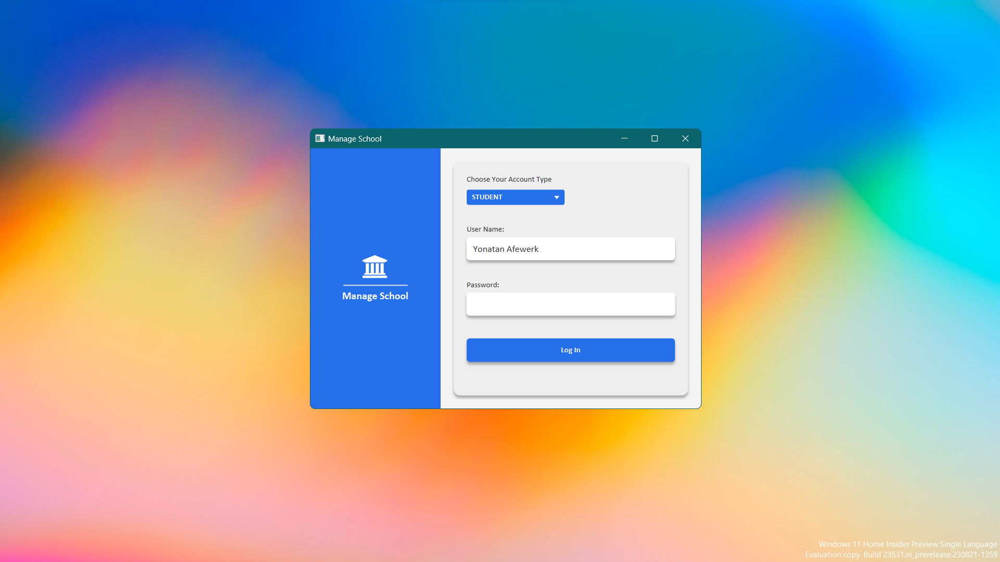

# ManageSchool

This is a simple Student Management System project with a focus on managing students, courses, and grades.

## Program Structure

-   **Admin:**

    -   Add students
    -   Manage available courses
    -   Assign grades

-   **Students:**
    -   Enroll in courses
    -   Drop enrolled courses
    -   View grade reports

## Possible Functionalities

-   **Authentication:**

    -   Verify user identity as admin or student during login.

-   **Admin Actions:**

    -   Add students, create courses, and assign grades.
    -   Insert records into StudentLog table for new students.
    -   Insert records into CoursesLog table for new courses.
    -   Update corresponding course tables to assign grades.

-   **Student Actions:**
    -   Enroll in courses and check grades.
    -   Insert records into Enrollments table for course enrollment.
    -   Query corresponding course tables to view grades.

---

#### Technologies Am learning along the way again :)
  - Java
  - JavaFX
  - sqLight
  - Scene Builder
  - IntelliJ IDEA

#### CheckList
    - Learn Model-View-Controller (MVC)
    - UI [On]
    - Dependecies [Done]
    - Backend 
        - Account Creation
        - Balance transfer
        - Authentication
        - other ...
    - Database [Done]
    - Connect backend with the UI
    - Deploy

In this project am planning to create a basic student management system with essential functionalities. As i develop it further, am gonna consider implementing additional features, enhancing the user interface, and following best practices for security and a some what better data management
